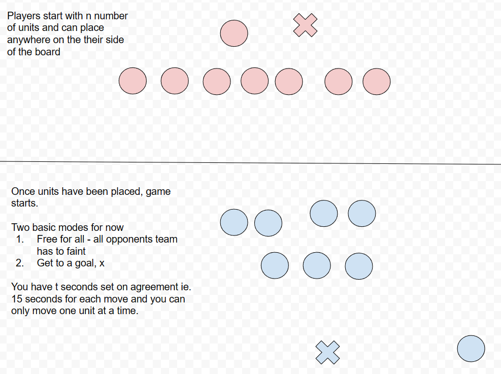
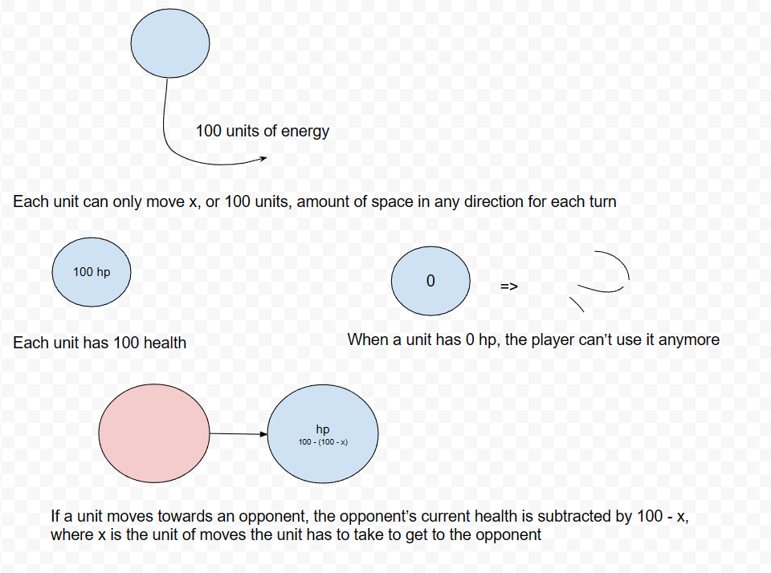
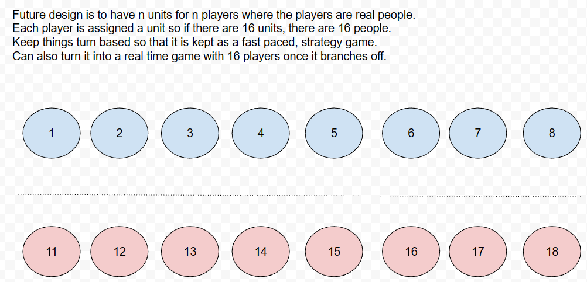
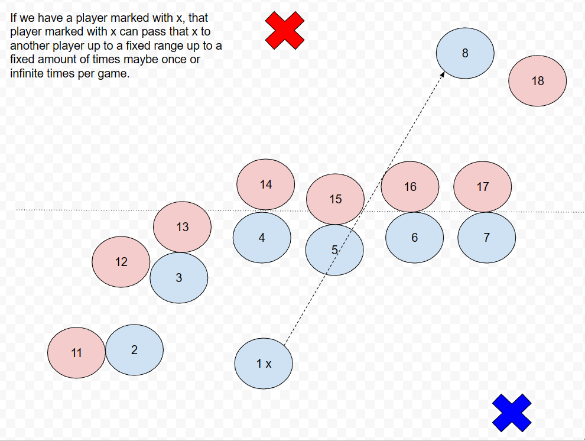
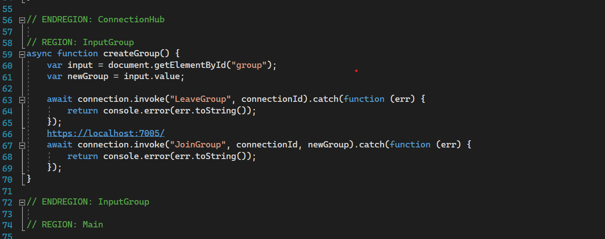
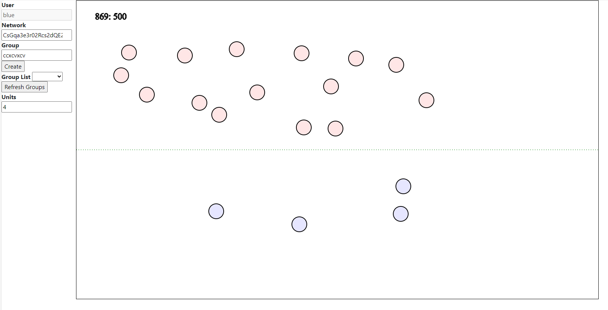

# game01

A simple game where there are two opponents and two modes - free for all and reach the objective.
Once the basis of this game is completed, the next version will have more game modes, more rules,
customizable units, sprites, and more. 
The overall objective of this simple game is to have players think outside the box when they are inside of the box.

### Guidelines

#### Javascript Guidelines
We'll tag the region of javascript into a region, as "// REGION \<Name\>", and close it with an end region tag, as "// ENDREGION \<Name\>"

This experimental pattern allows fast performance for javascript and agility for minimization.\
The philosophy of javascript is to keep it as small as possible so most of these function,\
ie. addEventListener, should actually be handled in the server side instead of the frontend.\
On the contrary, if we want the operations to be handled on the frontend, the tags\
allow scalable organization.

We can allow more variations in tagging sections of a single javascript file too,\
however, the best philosophy for javascript in my opinion is to keep it as small\
as possible.

### Current Design

-----

[An example of an experiment from this](http://github.com/ericung/topologyoffootwork)

[Canvas Refresh in Javascript](https://stackoverflow.com/questions/64341953/how-do-you-force-a-canvas-refresh-in-javascript)
